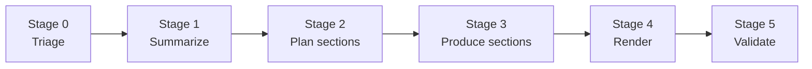

# Azri

Turn any GitHub PR or repo into a shareable, self-contained HTML explanation page.

[](./examples/pr-explainer.html)

---

## What is Azri

- **PR pages** — paste a pull request URL, get a readable HTML summary with context, diffs, and rationale.
- **Repo pages** — generate a high-level overview of any public repository's architecture and purpose.
- **OSS + bring-your-own-key** — self-host the bot or run the CLI locally; you supply the LLM API key.

---

## Live Demo

Open [`./examples/pr-explainer.html`](./examples/pr-explainer.html) in a browser to see a rendered PR explanation.

---

## Install — CLI

**Recommended (Bun):**

```sh
bun install -g @vdmkotai/azri
# or pin the current release
bun install -g @vdmkotai/azri@0.3.0
```

**npm:**

```sh
npm install -g @vdmkotai/azri
npm install -g @vdmkotai/azri@0.3.0
```

**pnpm:**

```sh
pnpm add -g @vdmkotai/azri
pnpm add -g @vdmkotai/azri@0.3.0
```

> **Note:** `npm` and `pnpm` install the package, but the CLI calls `bun` at runtime. Make sure `bun` is on your `PATH` before running `azri`.

**Quickstart:**

```sh
bunx azri pr https://github.com/owner/repo/pull/123
```

> **Don't have Bun?**
>
> ```sh
> curl -fsSL https://bun.sh/install | bash
> ```
>
> Then open a new terminal and re-run the install command above.

---

## Install — Bot (self-host)

The bot runs as a GitHub App and posts explanation links as PR comments. Railway is the fastest path to production.

1. **Fork** `https://github.com/vdmkotai/azri` and push to your account.
2. **Create a GitHub App** in your org or personal account. Set the webhook URL to `https://<your-railway-domain>/webhook`. Grant read access to pull requests and repository contents.
3. **Download the private key** (`.pem`) from the GitHub App settings page.
4. **Create a new Railway project** from your fork. Add the environment variables from [`.env.example`](./.env.example) — at minimum `GITHUB_APP_ID`, `GITHUB_PRIVATE_KEY`, `GITHUB_WEBHOOK_SECRET`, and one LLM key (`ANTHROPIC_API_KEY` or `OPENAI_API_KEY`).
5. **Deploy.** Railway picks up the `Dockerfile` automatically.
6. **Install the GitHub App** on the repos you want covered. Azri will comment on new PRs within seconds of opening.

For Fly.io and VPS deployment, see [`docs/OPERATOR.md`](./docs/OPERATOR.md).

---

## Configuration

Azri reads `.azri/config.json` at the repo root when generating repo pages. Minimum working config:

```json
{
  "modules": ["src"],
  "excludePaths": ["node_modules/**", "dist/**"],
  "maxFiles": 200,
  "maxLines": 10000,
  "telemetry": false
}
```

All environment variables are documented in [`.env.example`](./.env.example).

---

## Examples

- [`examples/pr-explainer.html`](./examples/pr-explainer.html) — a rendered PR explanation page
- [`examples/repo-overview.html`](./examples/repo-overview.html) — a rendered repo overview page

---

## Architecture

Azri v0.3 processes each request through a dynamic Section Registry pipeline:



| Stage | Name      | What it does                                                                     |
| ----- | --------- | -------------------------------------------------------------------------------- |
| 0     | Triage    | Classifies the input (PR diff, repo tree) and decides which sections to generate |
| 1     | Summarize | Produces a concise summary of the change or codebase                             |
| 2     | Plan      | Chooses the best section mix from the 37-type registry                           |
| 3     | Produce   | Fills selected sections in parallel with schema-validated output                 |
| 4     | Render    | Assembles the final HTML with Tailwind v4 utility classes loaded from CDN        |
| 5     | Validate  | Checks output quality and retries failed sections                                |

The pipeline is implemented in `packages/core` using Effect for typed error handling and structured concurrency. The v0.3 renderer dynamically composes 37 registered section types and themes pages with Tailwind v4 CDN utilities. The LLM layer is swappable via adapters in `packages/adapters/`.

---

## Roadmap

These items are deferred to v2 and are not in the current release:

- Private repo support (GitHub App installation token scoping)
- Payments adapter for hosted usage metering
- Hosted SaaS (azri.dev) with managed keys
- Multi-language UI (i18n)

---

## Status

**Alpha.** The core pipeline works. APIs and config formats may change without notice before v1.0.

---

## Contributing

See [`CONTRIBUTING.md`](./CONTRIBUTING.md). No CLA. DCO sign-off required (`git commit -s`).

---

## License

Apache 2.0. See [`LICENSE`](./LICENSE).

---

## Inspiration

Azri was inspired by Thariq Shihipar's article on AI-generated code explanations: [https://thariq.io/blog/ai-pr-explainer](https://thariq.io/blog/ai-pr-explainer).
